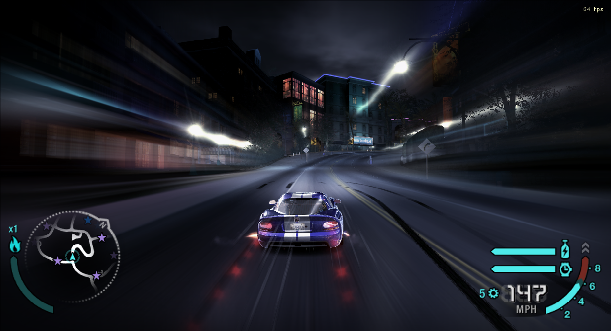

# NFS Carbon PC - Streak Flare fixer

A fixed particle shader and a complementary library to repair the game code for the PC version of NFS Carbon.

## What does this do?

This mod fixes the missing light streaks/trails from the light flares (namely light poles and traffic lights) on the PC version, giving a better Sense of Speed.

## How does it work (and why is it broken)?

There are 2 parts to this fix: shader fixes and code fixes

### Shader

For shaders, I had no choice but to resort to the Xbox 360 shaders from NFS Pro Street. Since the render pipelines between Carbon and Pro Street hadn't changed much at all for particle effects, the shaders worked almost right out of the box.

However, as I was adapting the 360 shaders, it was necessary to assign the filters and textures manually to the samplers. This was completely omitted from the 360 shader, causing it to not render at all by default. After adding it, particles worked with the 360 shader! (also needed to remap `cmWorldViewProj` to `WorldViewProj`)

Except for the `streak_flares` technique, that did not work.

`streak_flares` required its positions to be capped to the world position. Without this, they do not appear on screen. (`world_position(pv)`)

Secondly, what also was very necessary were some code fixes to repair the `cvBaseAlphaRef` variable. It was stubbed out on PC, which caused it not to draw (specifically `cvBaseAlphaRef.x` was stuck to 1.0, causing the vertex color to be transparent). This I'll explain in the next part.

And lastly, with this new shader came new bugs - the rain needed a completely custom technique because the fog rendering was affecting it too, causing it to be very faint and hard to see. Disabling the fog on it and scaling/multiplying the color up by 2 fixed the problem

### Code

Code fixes mostly revolve around restoring the cvBaseAlphaRef variable, but also fixing the rain streaks.

The plugin code (which you can see in dllmain.cpp) contains a hook to `FXLEffect_SetVectorFA` function which, as its name says, it sets a vector of an effect in memory. (This sets up and calls the `ID3DXBaseEffect::SetVector` function)

The hook basically takes the appropriate values from the game memory (in `pVisualTreatmentPlat`) and writes them to the vector.

This includes the speed of the camera, amount of NOS and the camera's X direction.

As for the rain, included is a hook to a function which controls some parameters in the shader during `Rain::Render`. By setting a custom technique in the shader called "raindrop" we can control the shader only on the rain and not the other particles.

This is done by calling `eEffect::SetCurrentPass`.

### What went wrong during PC porting?

It's hard to tell.

It might've been time constraints, it might've been poor development tools, it might've been poor PC hardware at the time.

My best guess is that Black Box didn't have enough time to optimize this part of the code to work on a wide variety of hardware because they were targeting support for a minimum of pixel shader model 1.1 whereas on consoles they didn't have that limitation.

We can safely assume that Black Box was mostly developing with NVIDIA GPUs on their PC dev machines as the game supports NVPerfHud natively.

## What does this look like and where can I get it?

You can download a release package in the Releases tab and try it for yourself.

The release package is compiled with VS2022, so you'll need the redistributables installed.

As for what it looks like, if you've seen the 360 version, you've seen the PC version too.

